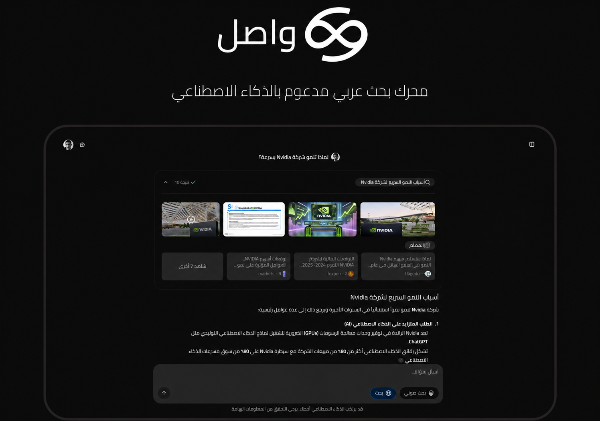

<div align="center">

# Wasel · واصل

**An open-source, AI-powered answer engine — built for Arabic.**

محرك بحث عربي مدعوم بالذكاء الاصطناعي

[](LICENSE)
[](https://github.com/marwan1265/wasel_v2/actions/workflows/ci.yml)
[](https://nextjs.org/)



</div>

## ✨ Why Wasel

Wasel is an open-source AI answer engine designed for Arabic. It pairs web
search with large language models to return streamed, cited answers, rendering
sources, images, and follow-up questions inline through a generative UI.

- 🌍 **Arabic-first** — right-to-left UI and Arabic-aware text handling throughout.
- 🔌 **Multi-provider** — route across OpenAI, Anthropic, Google, DeepSeek, Groq, xAI and more; choose models in config.
- 🧑‍🤝‍🧑 **Tiered access** — guest, free, and pro tiers with Redis-backed rate limiting.
- 💬 **Generative UI** — streaming answers with inline sources, images, and follow-up questions.
- 🗂️ **Dual-layer storage** — Supabase + Redis, with optional shareable conversations.
- 🐳 **Self-hostable** — bring your own keys; deploy on Vercel or via Docker.

## 🗂️ Overview

- ✨ [Why Wasel](#-why-wasel)
- 🛠 [Features](#-features)
- 🧱 [Tech Stack](#-tech-stack)
- 🚀 [Quickstart](#-quickstart)
- ⚙️ [Configuration](#%EF%B8%8F-configuration)
- 🤖 [Models & Providers](#-models--providers)
- 🌐 [Deploy](#-deploy)
- 🔎 [Browser Search Engine](#-browser-search-engine)
- 👥 [Contributing](#-contributing)

📝 Explore AI-generated documentation on [DeepWiki](https://deepwiki.com/marwan1265/wasel_v2).

## 🛠 Features

- AI-powered answers with a generative UI and visible reasoning
- Multiple search providers — [Tavily](https://tavily.com/), [SearXNG](https://docs.searxng.org/), [Exa](https://exa.ai/)
- Model selection from the UI, across multiple LLM providers
- Authentication via [Supabase](https://supabase.com/docs/guides/auth) (email/password + Google)
- Chat history and shareable results (optional)
- URL-specific and video search
- Optional CAPTCHA (Cloudflare Turnstile) on auth flows
- Docker-ready, and installable as a browser search engine

## 🧱 Tech Stack

- **Framework** — [Next.js](https://nextjs.org/) (App Router, React Server Components) + [TypeScript](https://www.typescriptlang.org/)
- **AI** — [Vercel AI SDK](https://sdk.vercel.ai/docs) for streaming & generative UI
- **Auth & DB** — [Supabase](https://supabase.com/) (Postgres, Auth, RLS)
- **Cache & rate limiting** — [Upstash](https://upstash.com/) / [Redis](https://redis.io/)
- **Search** — [Tavily](https://tavily.com/) (default), SearXNG, Exa
- **UI** — [Tailwind CSS](https://tailwindcss.com/), [shadcn/ui](https://ui.shadcn.com/), [Radix UI](https://www.radix-ui.com/), [Lucide](https://lucide.dev/)

## 🚀 Quickstart

### Prerequisites

- Node.js 20+ and npm
- A [Supabase](https://supabase.com/) project (free tier works) — see the [Supabase Setup Guide](docs/SETUP_SUPABASE.md)
- An API key for at least one AI provider (e.g. DeepSeek or OpenAI) and one search provider (e.g. [Tavily](https://app.tavily.com/home))

### Run locally

```bash
git clone https://github.com/marwan1265/wasel_v2.git
cd wasel_v2
npm install
cp .env.local.example .env.local
# Edit .env.local and set at minimum:
#   NEXT_PUBLIC_SUPABASE_URL, NEXT_PUBLIC_SUPABASE_ANON_KEY
#   an AI provider key (e.g. DEEPSEEK_API_KEY or OPENAI_API_KEY)
#   TAVILY_API_KEY
npm run dev
```

Open <http://localhost:3000>. Apply the database schema by following the
[Supabase Setup Guide](docs/SETUP_SUPABASE.md). Persistent chat history
additionally requires Redis (local or Upstash) — see the
[Configuration Guide](docs/CONFIGURATION.md). CAPTCHA is disabled by default
for local development (see [Configuration](#%EF%B8%8F-configuration)).

## ⚙️ Configuration

Copy `.env.local.example` to `.env.local` and fill in your keys. The full set of
optional features (search backends, additional providers, video search, SearXNG)
is documented in the [Configuration Guide](docs/CONFIGURATION.md).

### CAPTCHA (Cloudflare Turnstile) — optional

Bot protection on sign-up, login, and guest sessions is **optional**, controlled
by a single variable:

- `NEXT_PUBLIC_TURNSTILE_SITE_KEY` **unset** (default): no CAPTCHA — auth works
  out of the box for local development and self-hosting.
- `NEXT_PUBLIC_TURNSTILE_SITE_KEY` **set**: the Turnstile widget is required for
  all auth flows (recommended for production). You must also enable CAPTCHA with
  the matching **secret key** in your Supabase project under
  Auth → Attack Protection, since Supabase performs the verification.

## 🤖 Models & Providers

Wasel is provider-agnostic. The following LLM providers are supported:

> OpenAI · Anthropic · Google · Groq · DeepSeek · Zhipu (GLM) · xAI (Grok) ·
> Fireworks · Azure OpenAI · Ollama · any OpenAI-compatible endpoint

Image attachments (vision) are supported on vision-capable models — set a
model's `"vision": true` in the config. **GLM-4.6V** (Zhipu) is enabled by
default for this: **GLM-4.6V-Flash** is free and **GLM-4.6V** is a cheap,
higher-quality tier. Both need `ZHIPU_API_KEY` (see `.env.local.example`).

Models are defined in [`public/config/models.json`](public/config/models.json) —
enable the ones you have API keys for and select them from the UI. Each model
requires its provider's API key in your environment. DeepSeek is the default on
the hosted instance, but you can swap freely. See the
[Configuration Guide](docs/CONFIGURATION.md) for details.

## 🌐 Deploy

### Vercel

[](https://vercel.com/new/clone?repository-url=https%3A%2F%2Fgithub.com%2Fmarwan1265%2Fwasel_v2&env=NEXT_PUBLIC_SUPABASE_URL,NEXT_PUBLIC_SUPABASE_ANON_KEY,DEEPSEEK_API_KEY,TAVILY_API_KEY,UPSTASH_REDIS_REST_URL,UPSTASH_REDIS_REST_TOKEN)

### Docker

Build the image from the included `Dockerfile`:

```bash
docker build -t wasel .
```

Or use Docker Compose:

```yaml
services:
  wasel:
    build: .
    env_file: .env.local
    ports:
      - '3000:3000'
    volumes:
      - ./models.json:/app/public/config/models.json # Optional: override model config
```

The default model configuration lives at `public/config/models.json`. For Docker,
you can mount a `models.json` alongside `.env.local` to override it.

## 🔎 Browser Search Engine

You can set Wasel as a search engine in your browser:

1. Open your browser's search-engine settings ("Manage search engines and site search").
2. Under "Site search", click **Add**.
3. Fill in:
   - **Name**: Wasel
   - **Shortcut**: wasel
   - **URL**: `https://wasel.chat/search?q=%s`
4. Save, then optionally make it your default.

## 👥 Contributing

Contributions are welcome! Please read the [Contributing Guide](CONTRIBUTING.md)
for setup, conventions, and the pull request process, and see
[AGENTS.md](AGENTS.md) for project-specific gotchas. To report a security
vulnerability, follow the [Security Policy](SECURITY.md) instead of opening a
public issue.

## 📄 License

This project is licensed under the [Apache License 2.0](LICENSE).

## 🙏 Acknowledgements

Wasel is a fork of [Morphic](https://github.com/miurla/morphic), an AI-powered
answer engine created by [Yoshiki Miura](https://github.com/miurla) (Apache-2.0,
Copyright 2024 Yoshiki Miura). Wasel adds Arabic localization, multi-provider LLM
support, tiered authentication, Redis-backed rate limiting, and dual-layer
storage on top of that foundation. See the [NOTICE](NOTICE) file for attribution.
